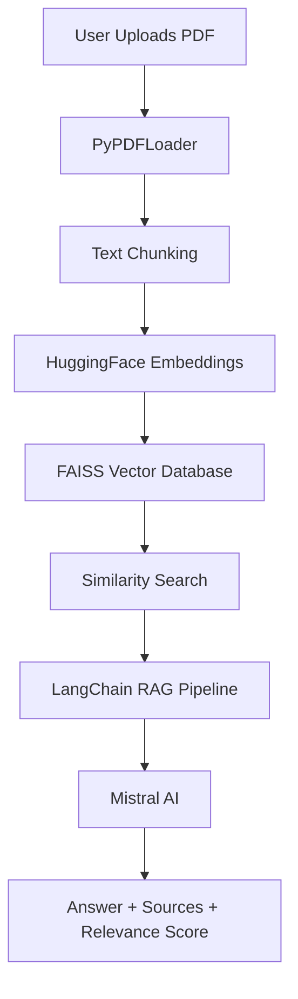
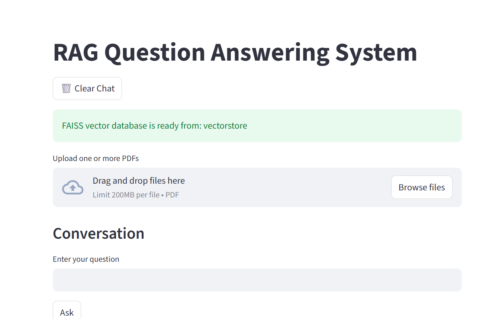
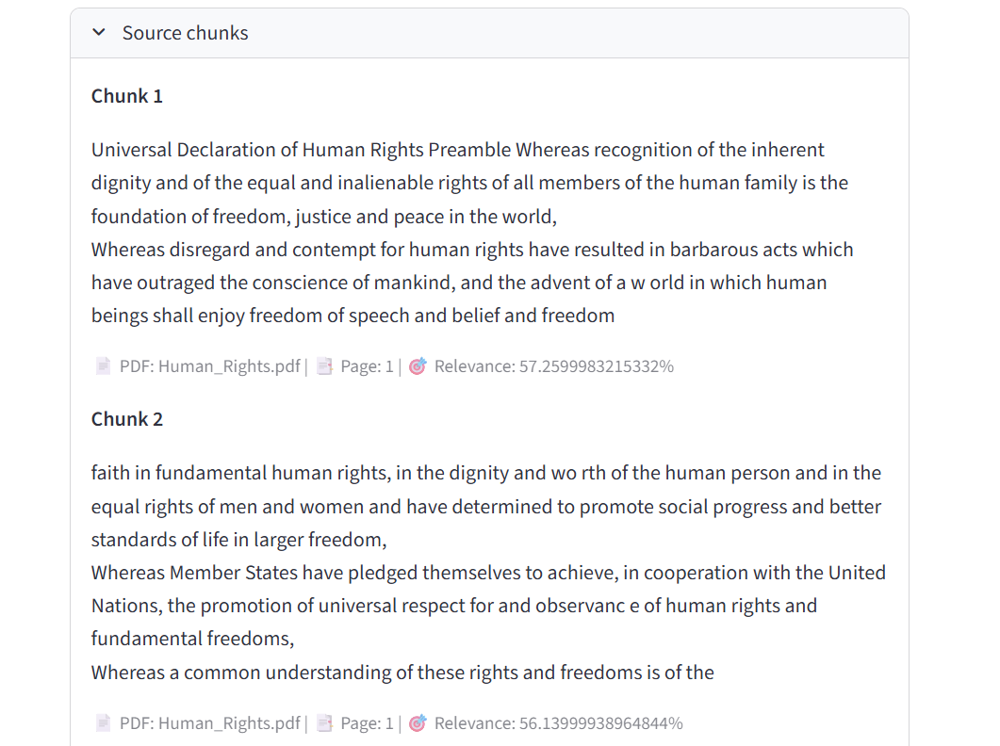
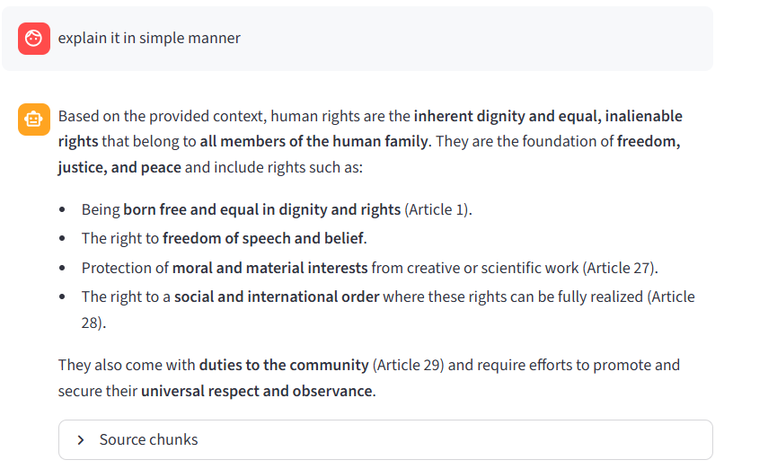

# 📚 RAG Question Answering System using LangChain, FAISS & Mistral AI

## 🚀 Overview

A production-style Retrieval-Augmented Generation (RAG) application that allows users to upload one or more PDF documents and ask natural language questions about their content.

The system uses semantic search with FAISS and HuggingFace embeddings to retrieve relevant document chunks and then leverages Mistral AI to generate context-aware answers grounded in the uploaded documents.

Unlike a traditional chatbot, the application answers only from the provided documents, reducing hallucinations and improving factual accuracy.

---

## ✨ Features

### 📄 Multi-PDF Upload

* Upload one or multiple PDF documents simultaneously.
* Automatically processes and indexes documents.

### 🔍 Semantic Search with FAISS

* Converts document chunks into vector embeddings.
* Retrieves the most relevant content using similarity search.

### 🤖 Mistral AI Integration

* Generates accurate answers based on retrieved document context.
* Prevents use of external knowledge.

### 🧠 Conversational Memory

* Maintains chat history across questions.
* Supports follow-up questions naturally.

### 🔄 Query Rewriting

* Rewrites follow-up questions into standalone questions.
* Improves retrieval accuracy.

### 📊 Source Transparency

* Displays retrieved source chunks.
* Shows PDF name and page number.

### 🎯 Relevance Score

* Displays relevance/confidence score for each retrieved chunk.
* Helps users understand retrieval quality.

### ⚡ Real-Time Document Processing

* Newly uploaded PDFs are automatically chunked, embedded, and indexed.
* No manual preprocessing required.

---

## 🏗️ System Architecture

## 🛠️ Tech Stack

### Frontend

* Streamlit

### LLM Framework

* LangChain

### Vector Database

* FAISS

### Embedding Model

* sentence-transformers/all-MiniLM-L6-v2

### Large Language Model

* Mistral Large

### Document Processing

* PyPDFLoader

### Programming Language

* Python

---

## 📂 Project Structure

Rag-Question-Answering-System/

├── app.py # Main Streamlit Application

├── ingest.py # PDF ingestion pipeline

├── requirements.txt # Project dependencies

├── vectorstore/ # FAISS vector database

├── data/ # Uploaded PDF files

├── .gitignore

└── README.md

└── images/ # Application Images

---

## 🔄 Workflow

### Step 1: Upload PDFs

Users upload one or more PDF documents.

### Step 2: Document Processing

The application:

* Reads PDFs
* Splits text into chunks
* Generates embeddings
* Stores vectors in FAISS

### Step 3: User Question

Users ask questions in natural language.

### Step 4: Retrieval

FAISS retrieves the most relevant document chunks.

### Step 5: Answer Generation

Mistral AI generates an answer using only retrieved context.

### Step 6: Source Attribution

The system displays:

* Retrieved chunks
* Source document
* Page number
* Relevance score

---

## 🎯 Example Use Cases

### Education

* Ask questions from lecture notes.
* Query academic PDFs.

### Legal Documents

* Search contracts and policies.

### Research Papers

* Extract findings from research documents.

### Company Knowledge Base

* Internal document search assistant.

---

## 📸 Application Screenshots

### 🏠 Home Page

### 💬 Question Answering Interface

### 📚 Source Chunk Display

### 🧠 Conversation Memory

## 🔒 Hallucination Reduction Strategy

The application follows a Retrieval-Augmented Generation approach:

* Retrieves relevant information first.
* Sends only retrieved context to the LLM.
* Restricts the model from using outside knowledge.
* Provides source attribution for verification.

This significantly improves factual grounding compared to a standard chatbot.

---

## 📈 Future Improvements

* Hybrid Search (BM25 + Vector Search)
* Answer Confidence Estimation
* Chat History Export
* User Authentication
* PostgreSQL Vector Storage
* Docker Deployment
* Oracle 26 AI Vector Database Integration
* Evaluation Dashboard

---

## ▶️ Installation

### Clone Repository

git clone <your-repository-url>

cd Rag-Question-Answering-System

### Install Dependencies

pip install -r requirements.txt

### Configure Environment Variables

Create a .env file:

MISTRAL_API_KEY=YOUR_API_KEY

### Run Application

streamlit run app.py

---

## 👨‍💻 Author

Aditya Sharma

Computer Science Student | Generative AI Enthusiast

Focused on:

* Retrieval-Augmented Generation (RAG)
* LangChain
* LLM Applications
* AI Engineering
* Vector Databases

---

## ⭐ Key Learning Outcomes

This project demonstrates:

* End-to-End RAG Pipeline Development
* LangChain Chain Construction
* FAISS Vector Database Integration
* Embedding-Based Retrieval
* LLM Prompt Engineering
* Conversational AI Design
* Streamlit Application Development
* Production-Oriented AI Application Architecture
